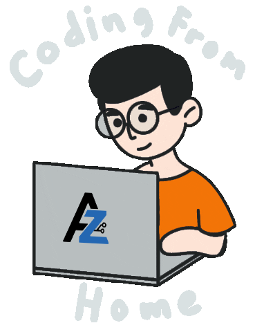

<h1 align="center">Hey 👋, I'm Abdulrahman Alkurdi</h1>

###

  <picture>
    <source media="(prefers-color-scheme: dark)" srcset="./assets/brand/dark/dark-logo-svg.svg">
    <source media="(prefers-color-scheme: light)" srcset="./assets/brand/light/light-logo-svg.svg">
    
  </picture>

###

  

###

  
 
  
 
  
 
  
 
  
 
  
 
  
 
  
 
  
 
  
 
  
  

###

<picture>
  <source media="(prefers-color-scheme: dark)" srcset="./assets/brand/dark/dark-coding-from-home.gif">
  <source media="(prefers-color-scheme: light)" srcset="./assets/brand/light/light-coding-from-home.gif">
  
</picture>

###

<h3 align="left">👩‍💻 About Me</h3>

###

  - 🔭 I'm working as Fullstack Developer  - 📚 I'm currently learning
  Nest.js  - ⚡ In my free time I am playing online games or reading

###

<h3 align="left">🛠 Language and tools</h3>

###

  

  

  
  

  
  

  
  

  
  

  
  

  
  

  
  

  
  

  
  

  
  

  
  

  
  

  
  

  
  

  
  

  
  

  
  <a href="https://nextjs.org/" target="_blank" rel="noreferrer">

  <picture>
      <!-- Dark mode trophy -->
      <source
        media="(prefers-color-scheme: dark)"
        srcset="./assets/tech-stack/next-white.png"
      />
      <!-- Light mode trophy -->
      <source
        media="(prefers-color-scheme: light)"
        srcset="./assets/tech-stack/nextjs-original.svg"
      />
      <!-- Fallback (light) -->
      
    </picture>
  </a>

  
  

  
  

  
  

  
  

  
  

  
  

  
  

  
  

  
  

  
  

  
  

###

<h3 align="left">🔥 My Stats :</h3>

###

  <a href="https://github.com/ryo-ma/github-profile-trophy">
    <picture>
      <!-- Dark mode trophy -->
      <source
        media="(prefers-color-scheme: dark)"
        srcset="https://github-profile-trophy.vercel.app/?username=akz3ro&theme=dracula"
      />
      <!-- Light mode trophy -->
      <source
        media="(prefers-color-scheme: light)"
        srcset="https://github-profile-trophy.vercel.app/?username=akz3ro&theme=light"
      />
      <!-- Fallback (light) -->
      
    </picture>
  </a>

###

  <!-- GitHub Stats -->
  <picture>
    <source
      media="(prefers-color-scheme: dark)"
      srcset="https://github-readme-stats.vercel.app/api?username=akz3ro&show_icons=true&theme=dracula&locale=en"
    />
    <source
      media="(prefers-color-scheme: light)"
      srcset="https://github-readme-stats.vercel.app/api?username=akz3ro&show_icons=true&theme=light&locale=en"
    />
    
  </picture>

  <!-- Streak Graph -->
  <picture>
    <source
      media="(prefers-color-scheme: dark)"
      srcset="https://streak-stats.demolab.com?user=akz3ro&mode=daily&theme=dracula&locale=en"
    />
    <source
      media="(prefers-color-scheme: light)"
      srcset="https://streak-stats.demolab.com?user=akz3ro&mode=daily&theme=light&locale=en"
    />
    
  </picture>

  <!-- Top Languages -->
  <picture>
    <source
      media="(prefers-color-scheme: dark)"
      srcset="https://github-readme-stats.vercel.app/api/top-langs?username=akz3ro&layout=compact&langs_count=5&theme=dracula&locale=en"
    />
    <source
      media="(prefers-color-scheme: light)"
      srcset="https://github-readme-stats.vercel.app/api/top-langs?username=akz3ro&layout=compact&langs_count=5&theme=light&locale=en"
    />
    
  </picture>

###

  <picture>
    <source media="(prefers-color-scheme: dark)" srcset="https://raw.githubusercontent.com/akz3ro/akz3ro/output/pacman-contribution-graph-dark.svg">
    <source media="(prefers-color-scheme: light)" srcset="https://raw.githubusercontent.com/akz3ro/akz3ro/output/pacman-contribution-graph.svg">
    
  </picture>

###

  <picture>
    <source
      media="(prefers-color-scheme: dark)"
      srcset="https://raw.githubusercontent.com/akz3ro/akz3ro/output/pacman-contribution-graph-dark.svg"
    />
    Dark‑mode Pacman
    <source
      media="(prefers-color-scheme: light)"
      srcset="https://raw.githubusercontent.com/akz3ro/akz3ro/output/pacman-contribution-graph.svg"
    />
    fallback
  </picture>

<!-- Snake Animation -->
<!-- 

  <picture>
    <source
      media="(prefers-color-scheme: dark)"
      srcset="https://raw.githubusercontent.com/akz3ro/akz3ro/output/snake-dark.svg"
    />
    Light‑mode snake
    <source
      media="(prefers-color-scheme: light)"
      srcset="https://raw.githubusercontent.com/akz3ro/akz3ro/output/snake-light.svg"
    />
    fallback
    
  </picture>

###-->

  

###
